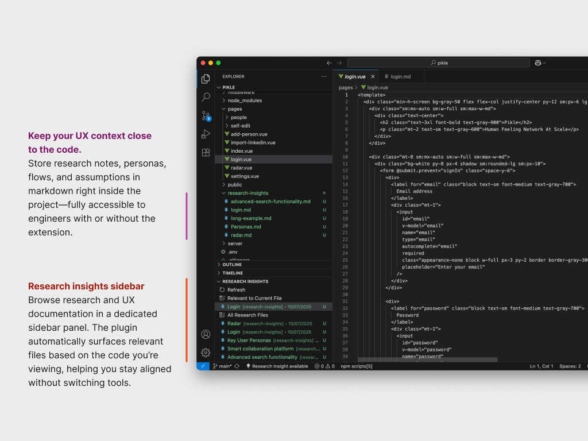
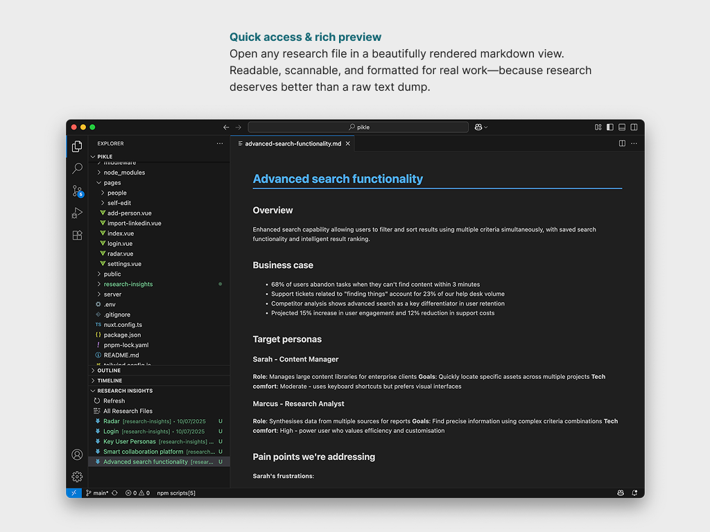

# UX & Research Insights for VS Code

An engineer-friendly VS Code extension to surface and connect UX research insights directly within your codebase. Make research actionable and accessible for everyone on your team.




---
### Manual Local Install of Compiled Version

[Download the compiled extension → ux-insights.vsix](./ux-insights.vsix)

Local install
```
code --install-extension "[PATH TO THE FILE]/ux-insights.vsix"
```
---

## Features

- **Research Insights Sidebar**: Browse all markdown-based research and UX documentation in a dedicated sidebar view.
- **Auto-Discovery of Research Folders**: Automatically finds folders like `research`, `ux`, `insights`, or configure your own search paths.
- **Relevant Insights for Current File**: Instantly see which research files are relevant to the file you're editing, highlighted at the top of the sidebar and in the status bar.
- **Quick Access & Rich Preview**: Open any research file in a beautiful, readable Markdown webview panel.
- **Status Bar Integration**: Get notified when relevant insights are available for your current file—just click the lightbulb icon to view them.
- **Instant Refresh**: Add or update research files and refresh the list with a single click.

## Getting Started

1. **Install** Download this compiled version of the extension → 'ux-insights.vsix' and install 
2. **Add research files** (Markdown, `.md`) to folders like `research`, `ux`, `insights`, or configure your own paths (see below).
3. **Open the Research Insights sidebar** from the Explorer pane.
4. **Click any file** to preview it, or use the status bar lightbulb to see relevant insights for your current file.

## Configuration

You can customize how and where the extension looks for research files:

- `researchInsights.searchPaths` (array): Folders to search for research markdown files. Defaults to common research/UX folder names.
- `researchInsights.autoDetect` (boolean): Automatically detect research folders in your workspace. Defaults to `true`.

Configure these in your VS Code `settings.json` or via the Settings UI.

## Commands

- `ux-insights.openResearchPanel`: Open a quick file selector for all research files.
- `ux-insights.refreshResearchFiles`: Refresh the research file list.
- `ux-insights.openResearchFile`: Open a selected research file in a webview.

## Requirements

No special requirements. Works with any VS Code workspace containing markdown research files.

## Contributing

Contributions, issues, and feature requests are welcome! Please open an issue or pull request on GitHub.

## License

MIT — see [LICENSE](LICENSE) for details.
